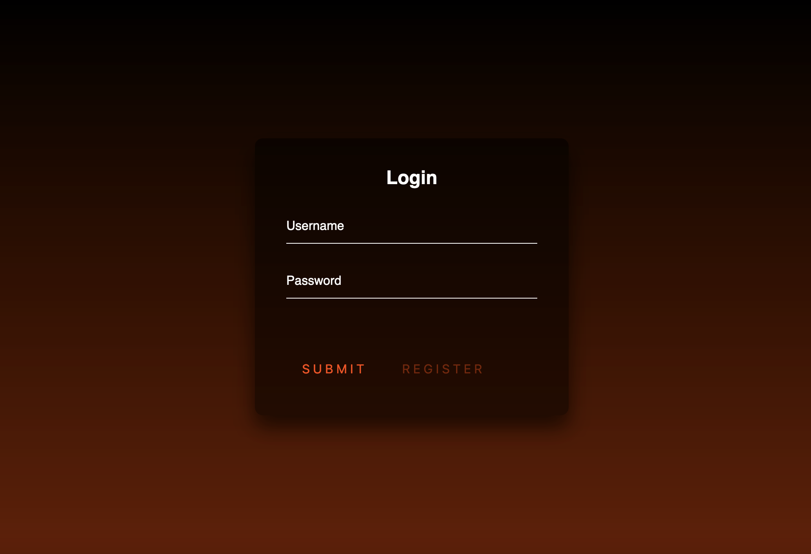

# GraphicExpressAuthorization
This is very simple authorization for your site. There are a lot of options you can tune. 

## Usage 

Connect the library as 

```js
const GraphicExpressAuthorization = require('./index');

const users = {
    "Ivan": sha512("T,fZDfiRjyT,f")
};
// authorization function has to return payload with login or null
const {graphicExpressAuthorization, router, identification} = new GraphicExpressAuthorization({
    authorization: function authorization(login, password) { // funtion to verify password and login
        if(!users[login]) return null;
        if(users[login] === sha512(password)) return {login, payload: "123"};
        return null;
    },
    bruteforce:{ // optional
        delay: 5000 // delay between password entry
    },
    htmlPath: null, // if you need to use your own html, details below
    jwt: {
        privateKey:require('crypto').randomBytes(256).toString("hex"),
        payload: ["payload"],// allowed payload from authorization function and JWT
        // publicKey: publicKey, // synchronous encryption methods are also supported
        timeToRecreateToken: 600, //10 minutes
        genConfig: {
            algorithm:"HS256",
            expiresIn: '2h'
        }
    },
    authPath:"/api/" // have to be the same as api router path
});

```
Next step is connect router to your express app. There is simple example.
It's very important that the paths match. (authPath and api router path)
```js
const express = require('express');
const app = express();
const cookieParser = require('cookie-parser');

app.use("/api/", router); // have to be the same as authPath

app.get("/enter", cookieParser(), identification, (req,res)=>{ // identification can't be global
    res.json({ message: 'WELCOME'});
});
app.listen(3000, () => {
    console.log(
        ` ┍━━━━━━━━━━━━━━━━━━━━━━━━━━━━━━━━━━━━━━━━━━━━━━━━━━━━━━━━━━━━━━━━━━━━━┑` + "\n"+
        ` ┝━━┥ Server is started.` + "\n"+
        ` ┝━━┥ http://localhost:3000/enter` + "\n"+
        ` ┕━━━━━━━━━━━━━━━━━━━━━━━━━━━━━━━━━━━━━━━━━━━━━━━━━━━━━━━━━━━━━━━━━━━━━┙`
    );
});
```
## Own HTML
If you need to use your own html you need to specify the path to the HTML file in htmlPath property.
There is default page.


If you decide to make your own html you have to connect authentication.js and assign ids.
### Connection authentication.js
```html
  <script src="./authentication.js"></script>
```
### Ids to be assigned
```css
#loginButton /* Login button */
#loginField /* Login field ( must have value property ) */
#passwordField /* Password field ( must have value property ) */
#statusField /* The field to which the information will be output. Optional. */
```
